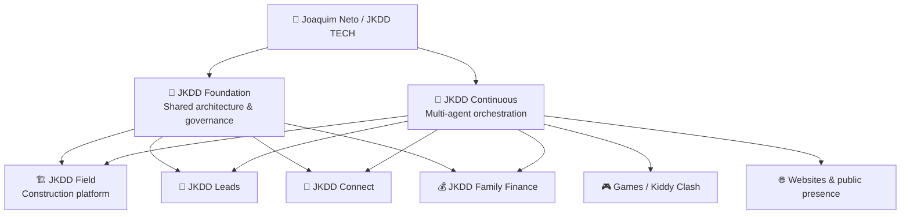

<div align="center">

# Joaquim Neto

### Civil Engineer · Founder of JKDD TECH · Software, AI Automation & Digital Product Builder

Building practical software, AI-assisted workflows and digital products for construction, field operations, business management and interactive experiences.

[](https://jkddtech.com)
[](https://github.com/joukinneto)

<br/>


</div>

---

## 🚀 JKDD TECH — Current Ecosystem

**JKDD TECH** is my growing technology and product-development ecosystem.

The portfolio has evolved from isolated construction tools into a broader architecture composed of:

- a shared **Foundation-first** platform;
- modular construction and field applications;
- independent business products;
- AI-assisted and multi-agent engineering orchestration;
- public websites and product portals;
- experimental games and interactive products;
- governed Development/Test → Production workflows.

My work combines **Civil Engineering domain knowledge** with software architecture, product design, automation, AI-assisted development and multi-platform delivery.

### Repository growth snapshot

| Area | Current direction |
|---|---|
| **JKDD Field** | Expanding modular construction / field-operations platform |
| **JKDD Continuous** | Multi-agent engineering orchestration for apps, games and websites |
| **JKDD Leads** | Lead acquisition, qualification, routing and measurement |
| **JKDD Connect** | Smart digital identity, QR/NFC sharing and professional contact product |
| **JKDD Family Finance** | Personal and family financial management |
| **Kiddy Clash** | Multiplatform children's game under active Development/Test |
| **JKDD TECH Web** | Corporate portal and public product presence |
| **Core / Engines** | Shared Foundation architecture and estimating engine |

> Active commercial source code is private by default. Public repositories expose selected products, websites and experiments without requiring proprietary application code to be public.

### 🧭 Ecosystem map



### ⚡ Quick access

| Area | Repository |
|---|---|
| 🤖 **Agent orchestration** | [jkdd-continuous](https://github.com/joukinneto/jkdd-continuous) |
| 🧱 **Shared platform foundation** | [jkdd-foundation](https://github.com/joukinneto/jkdd-foundation) |
| 🏗️ **Field application host** | [jkdd-field-host](https://github.com/joukinneto/jkdd-field-host) |
| 🦺 **Safety & Quality** | [jkdd-field-safety-quality](https://github.com/joukinneto/jkdd-field-safety-quality) |
| 🎯 **Lead platform** | [jkdd-leads](https://github.com/joukinneto/jkdd-leads) |
| 🎮 **Kiddy Clash** | [kiddy-clash](https://github.com/joukinneto/kiddy-clash) |
| 🌐 **JKDD TECH website** | [jkdd-tech-site](https://github.com/joukinneto/jkdd-tech-site) |
| 🧠 **Skills registry** | [skills](https://github.com/joukinneto/skills) |

---

## 🤖 JKDD Continuous — Multi-Agent Engineering

**JKDD Continuous** is the central engineering-orchestration initiative for the JKDD TECH ecosystem.

Its operating model coordinates specialized agents, tools, repositories, workflows, memory, testing, documentation and release controls under one governed structure.

### Current orchestration model

```text
Owner / JKDD TECH
        ↓
Master Supervisor
        ↓
Specialized Agents
        ↓
Repositories / Tools / QA / Documentation
        ↓
Consolidated Results
```

Key principles:

- one central orchestration layer for engineering work;
- direct agent-to-agent coordination rather than manual message relay;
- governed integration of external capabilities through adapters and skills;
- Development/Test automation where authorized;
- auditable actions and protected secrets;
- **Production remains separately controlled and requires explicit authorization**.

JKDD Continuous is currently being used as the coordination model for products such as **Kiddy Clash** and new JKDD Field development work.

---

## 🏗️ JKDD Field — Modular Construction Platform

**JKDD Field** is the main construction and field-operations product family.

It is organized around a shared platform architecture with specialized modules instead of duplicated standalone applications.

| Application type | Products / Modules |
|---|---|
| **Platform** | JKDD Field Host |
| **Operations & Workforce** | Field Time · Field Control · Field Planning · Field Docs |
| **Estimating & Calculation** | Field Calc · Field Estimate |
| **Finance & Commercial** | Field Cost · Field Billing · Field Accounting |
| **Assets & Logistics** | Field Fleet · Field Inventory |
| **Intelligence & Management** | Field Dashboard |
| **Safety & Quality** | Field Safety & Quality |

### Repository footprint

The JKDD Field family currently spans **14 dedicated repositories** across host/platform, workforce, estimating, finance, assets, intelligence, planning and safety/quality domains.

### Recent expansion

The platform now includes a dedicated **Field Safety & Quality** domain for inspections, incidents, hazards, Toolbox Talks, punch lists, defects, rework, corrective actions, evidence and verification workflows.

Current development follows governed lifecycle rules: architecture and contracts first, then implementation, QA, exact integration and Development/Test verification before any Production promotion.

---

## 🧱 Core Architecture & Shared Engines

| Component | Role |
|---|---|
| **JKDD Foundation** | Shared architecture, authentication, identity, permissions, security, localization, contracts and governance |
| **JKDD Estimate Engine** | Shared deterministic estimating and pricing engine |
| **JKDD Continuous** | Multi-agent execution and engineering orchestration layer |

The ecosystem follows a **Foundation-first** model:

> Shared capabilities are defined once and reused across products instead of rebuilding authentication, permissions, company context, localization, security and platform contracts in each application.

---

## 🎯 Independent Products

### JKDD Leads

**JKDD Leads** focuses on lead acquisition, qualification, routing and measurement.

The product follows the rule:

```text
ONE LEAD → ONE CANONICAL RECORD → MULTIPLE PRODUCT VIEWS
```

Development is governed separately from Production, while shared identity, security, RBAC/RLS and platform services reuse JKDD Foundation contracts.

[View repository](https://github.com/joukinneto/jkdd-leads)

### JKDD Connect

**JKDD Connect** is a smart digital identity and contact product designed around:

- digital profiles;
- public shareable pages;
- QR-based sharing;
- NFC-oriented workflows;
- authenticated profile management;
- mobile-first experiences.

Its current application baseline uses **Next.js**, while shared platform concerns remain aligned with JKDD Foundation contracts.

### JKDD Family Finance

**JKDD Family Finance** is an independent product for personal and family financial organization, built under the same governed Development/Test principles used across the JKDD ecosystem.

---

## 🎮 Games & Interactive Products

### Kiddy Clash

**Kiddy Clash — Aventura dos Pequenos Heróis** is a free multiplatform children's game being developed by JKDD TECH.

Current approved direction includes:

- Web / PWA;
- iOS;
- Android;
- Windows;
- Portuguese and English;
- original characters;
- races, adventures and mini games;
- computer-controlled opponents;
- online multiplayer architecture.

Current stack:

<div align="center">


</div>

[View Kiddy Clash](https://github.com/joukinneto/kiddy-clash)

---

## 🌐 Websites & Public Web Presence

| Website / Project | Purpose | Access |
|---|---|---|
| **JKDD TECH** | Corporate and product portal | [Visit site](https://jkddtech.com) |
| **JKDD TECH Site Repository** | Institutional website and product portal | [Repository](https://github.com/joukinneto/jkdd-tech-site) |
| **JKDD Leads** | Public product presence and lead platform | [Repository](https://github.com/joukinneto/jkdd-leads) |
| **JKDD Leads Site** | Product marketing website | [Repository](https://github.com/joukinneto/jkdd-leads-site) |
| **Kener Santana** | Professional website | [Repository](https://github.com/joukinneto/site-kener-santana) |

---

## 🛠️ Technology Stack

<div align="center">


</div>

**Product direction:** mobile-first, responsive and multi-platform experiences for **Web, Android, iPhone and Windows** where technically appropriate.

---

## 🧭 Engineering & Governance Principles

- **Foundation first** — shared architecture before duplicated implementations.
- **Mobile first** — responsive field and business UX.
- **Multi-platform when practical** — reuse a shared core across supported targets.
- **AI-assisted engineering** — agents and tools support implementation, QA and documentation.
- **Development → Test → Production separation**.
- **Production protection** — no automatic promotion without explicit authorization.
- **Pull Request + CI governance** for controlled changes.
- **Private-by-default source code** for active commercial applications.
- **Canonical ownership** — each domain has one source of truth.
- **Auditable automation** — agent and tool actions must remain traceable.

---

## 📈 Evolution of the Portfolio

The repository portfolio has grown beyond the original FieldOS / calculator experiments into a structured product ecosystem with:

- shared Foundation architecture;
- multiple JKDD Field operational modules;
- estimating and financial workflows;
- safety and quality workflows;
- lead-management products;
- digital identity products;
- family-finance tooling;
- public sites;
- a multi-agent engineering office;
- and a multiplatform game project.

The emphasis is no longer simply on creating individual apps. The current direction is to build a **coherent, governed product ecosystem** in which architecture, agents, reusable services, testing and release controls can scale together.

---

## ⚫ Legacy & Historical Reference

**FieldOS** is a retired pilot preserved only as historical and functional reference. It is not part of the active JKDD Field architecture.

The previous **jkdd-legacy-field-calc-web** repository is also archived and retained only for history/reference.

---

## 👷 Civil Engineering × Technology

My background in **Civil Engineering** directly informs how I design software for real construction and field workflows:

- time tracking;
- estimating;
- costs and billing;
- accounting;
- fleet and inventory;
- planning;
- documentation;
- safety and quality;
- operational control;
- executive visibility.

The objective is to build technology that works not only in code, but in the actual operational context of field teams and construction businesses.

---

<div align="center">

### JKDD TECH

**Engineering practical software, intelligent workflows and scalable digital products.**

</div>
